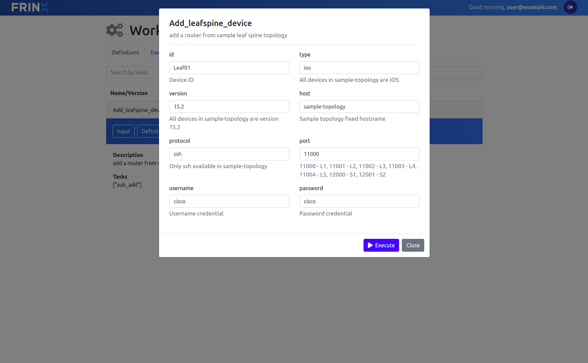

## Create a new device in the inventory

In our first workflow we will create a device entry in our inventory via the Unifonfig UI. We have prepared workflows that will help you to enter the information for the devices available in our sample-topology.

Click on :menuselection:`Home --> Workflows --> Definitions` and search for the workflow called **Add_leafspine_device**. Select the tab "Input" and verify that the form is pre-filled with defaults for the first device "Leaf01". The form should look similar to this:

Click on the "Execute" button and you should see an ID pop up on the left hand side of hte "Execute" button.

Now enter the next device "Leaf02" in the ID field and also enter the port number for device Leaf02. You can find the port number in the description of the port field. The port number for Leaf02 is 11001. After you have entered ID and port fields click the "Execute" button again.

Continue to enter the data for all seven devices *Leaf01*, *Leaf02*, *Leaf03*, *Leaf04*, *Leaf05*, *Spine01* and *Spine02* with the following port numbers:

| Device ID   | Port Number |
| -------     | ----------- |
| Leaf01      | 11000       |
| Leaf02      | 11001       |
| Leaf03      | 11002       |
| Leaf04      | 11003       |
| Leaf05      | 11004       |
| Spine01     | 12000       |
| Spine02     | 12001       |

After you have entered all devices, go to Kibana and show the data under the index pattern "inventory". If you are using Kibana for the first time, you will have to create a new index pattern called "inventory". 

To create a new index pattern click on "Management" in the left hand side bar, select "Index Patterns" and click on the button "Create Index Pattern". Enter "inventory" in the index pattern field and click "Create". 

Now click on "Discover" in the left hand side bar and you should see all devices that you have entered in the step before. You should see a view similar to the following:

[>>> Mount the devices in FRINX OpenDaylight <<<](3.md)
