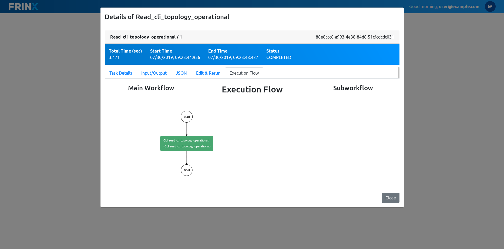
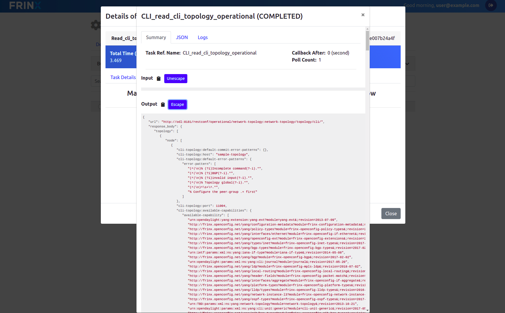

# Mount the devices in FRINX OpenDaylight

Next we want to mount the devices in ODL. The mount operation for NETCONF or CLI devices in ODL results in a permanent connection that is established, maintained and if necessary re-established with the device. Once a device is mounted in FRINX OpenDaylight, it can be accessed via the UniConfig framework for reading and writing of configuration and operational data. The next workflow will mount the device in FRINX ODL. 

Click on `Home --> Workflows --> Definitions` and search for the workflow to mount all devices that are in the inventory: **Mount_all_cli_from_inventory**

The workflow requires no additional parameter to run. As always, if you want to look at the details of the workflow, click on the workflow ID that popped up next to the "Execute" button.

The workflow will only finish successfully if all devices have been mounted to FRINX ODL. You can verify that all devices are successfully connected by running the following workflow:

 Click on read-cli-topology-operational-details and search for **Read_cli_topology_operational**.

After clicking the workflow ID and selecting the "Execution flow" tab, you should see the following.

In this graphical representation of the workflow, click on the green box with the workflow name to see details about the workflow output. You should see a similar view like this:

The workflow output shows the status of all devices and you can verify that the devices have been connected successfully.