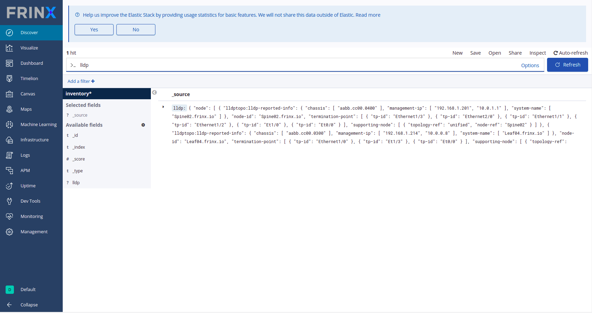

# Collect LLDP Information from Devices and Build Topology

​In the following step we will start a workflow that goes to each mounted device, collects LLDP information, reconciles that information and finally stores that information in the inventory.

​To run the workflow click on click on read-cli-topology-operational-details and search for **Build_read_store_LLDP_topology**.

​Go to the input tab of the workflow. The workflow has default parameters filled out. The values should be the following:

```
node_aggregation: (leave blank)
link_aggregation: (leave blank)
per_node_read_timeout: 30
concurrent_read_nodes: 8
destination_topology: lldp
```

Click on "Execute".


​After the workflow has completed, go to Kibana and look for an entry called "lldp". You should see a similar view like the following:​


