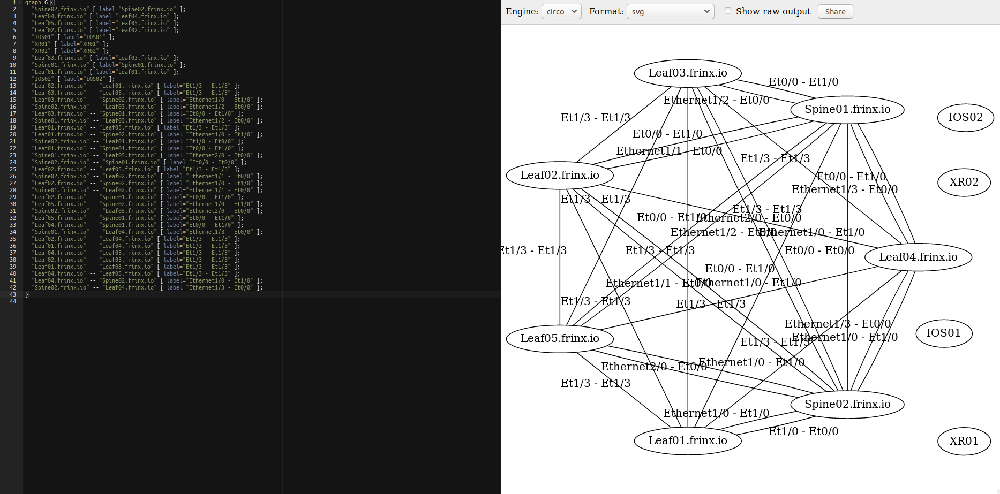

# Exporting the IETF topology information in graphviz format

​To export the LLDP topology data in a format that can be used for visualization in 3rd party tools run the following workflow:

​Click on `Home --> Workflows --> Definitions` and search for **Export_LLDP_topology**.

Execute it and click on the workflow ID, select the workflow again, choose "Execution flow" and click on the green box with the workflow name to display the workflow output details. Click "Unescape" to unescape the Output.

​​Finally you can use any 3rd party visualization tool that can support the graphviz format like https://dreampuf.github.io/GraphvizOnline.

​All workflows can be executed manually as shown in this demo or can be scheduled via the workflow scheduling features.