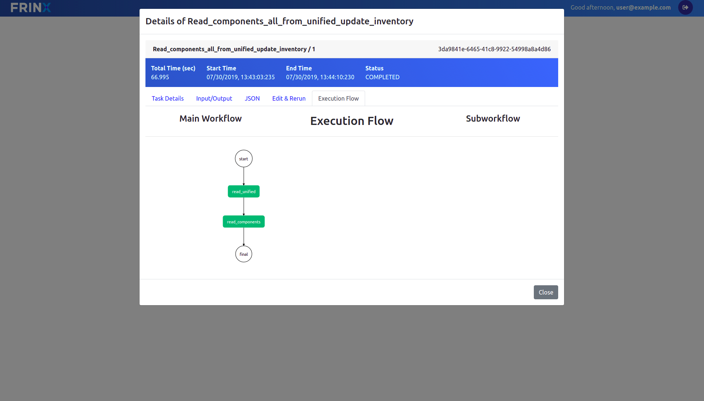
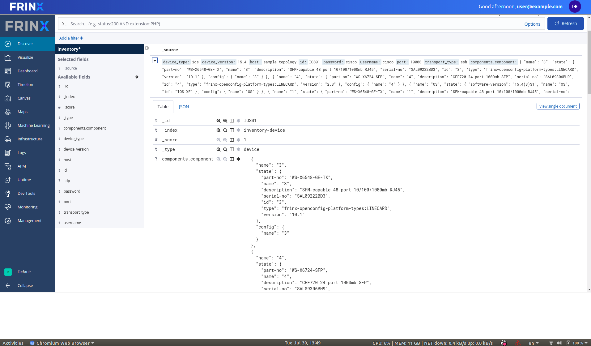

# Collect platform information from the device and store in the inventory

In the next step we will execute a workflow that collects platform information from every mounted device, converts the vendor specific information into OpenConfig format and writes the resulting data to the inventory.

Click on: `Home --> Workflows --> Definitions`

Then search for the workflow **Read_components_all_from_unified_update_inventory**

Once selected, you can execute the workflow without providing additional information. Click on the the workflow ID that popped up to see the progress and additional details about this workflow. You should see something similar to this:

After the main and sub-workflows have completed successfully the platform information is now stored in the inventory as a child entry to the device ID that the information comes from.

The execution of all workflows can be manually, via the UI, or can be automated and scheduled via the REST API of conductor server.