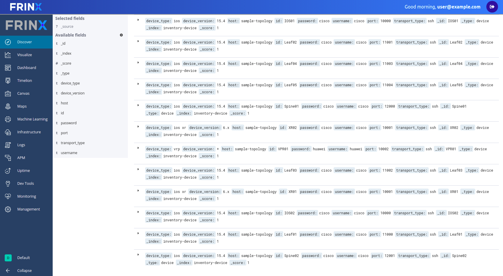
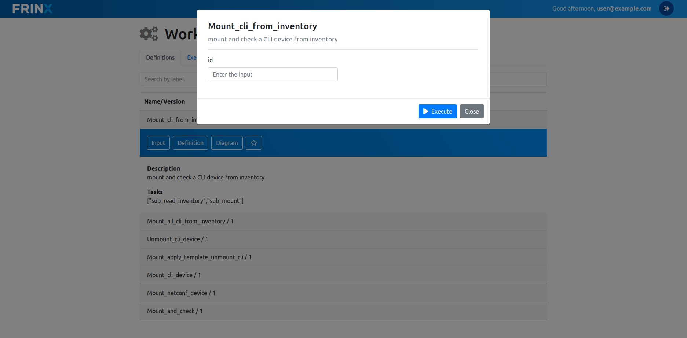
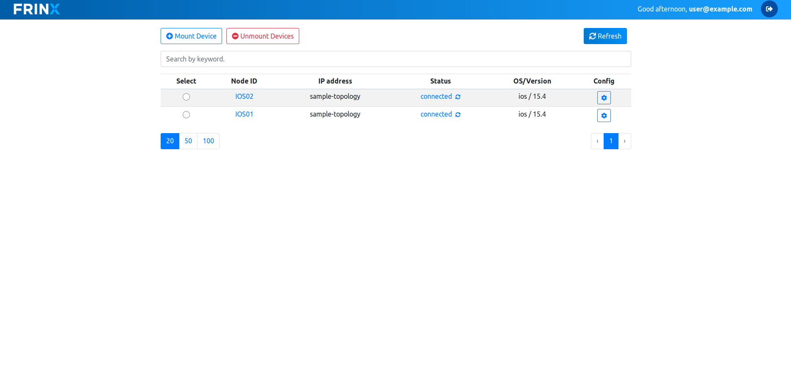

# Mount devices


In order to be able to mount run the **Create_L2VPN_P2P_OC_uniconfig** workflow, we need to have devices already mounted. We are going to work with two IOS devices.

To mount them, lets find and run the workflow called **Mount_cli_from_inventory**. The inventory should be pre-filled for you already. You can verify that by going to `Home --> Inventory`. Click on discover a in the pane on the left side and you should see a list of devices similar to the following.




**NOTE:**
``` text
If you are using Kibana for the first time, you will have to create a new index pattern called “inventory”.

To create a new index pattern click on “Management” in the left hand side bar, select “Index Patterns” and click on the button “Create Index Pattern”. Enter “inventory*” in the index pattern field and click “Create”.

Now click on “Discover” in the left hand side bar and you should see all devices that you have entered in the step before.
```

After confirming that the inventory is filled correctly, lets mount two IOS devices. In `Home --> Workflows --> Definitions` search for the workflow called **Mount_cli_from_inventory**. Click on input and input "IOS01" as the input parameter. Click on "Execute". On the left hand side of the "Execute" button, a workflow ID wil pop up. 





Click on it to see the progress of that workflow. Now the **IOS01** should be mounted. Do the same with the "IOS02" device.

You can verify that both devices are mounted by going to `Home --> Workflows --> UniConfig UI`. The  




