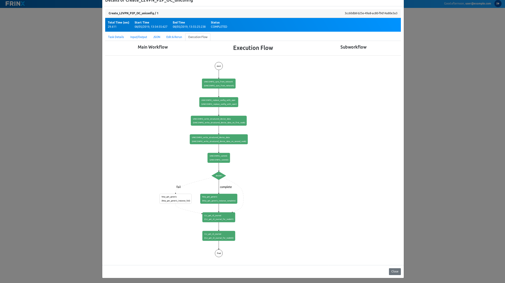

# Running the L2VPN workflow


In `Home --> Workflows --> Definitions` search for the workflow called **Create_L2VPN_P2P_OC_uniconfig**. A pre-filled modal should pop up.
The parameters should be as follows:

```text
node01: IOS01
interface01: GigabitEthernet1
vcid: 444
node02: IOS02
interface02: GigabitEthernet3
```

Click "Execute" and click on the workflow ID that popped up next to the "Execute" button. Gradually, the workflow spins up multiple tasks, which you can see in the "Execution flow" tab.





In this workflow, there are several things happening:

- sync_from_network
- replace_config_with_operational
- write_structured_device_data
- commit
- decide
    - http_get_generic_instance_fail
    - http_get_generic_instance_complete
    - get_cli_journal

The `sync_from_network` makes sure that the device configuration is up to date. After that the `replace_config_with_operational` replaces the configurational datastore with the operational datastore. After that `write_structured_device_data` writes the configuration to each of the two nodes and `commit` is the command that sends this configuration to the devices. After that, in case the configuring of devices fails, `http_get_generic_instance_fail` would run next. If it is successful the `http_get_generic_instance_comlete` follows. After that `get_cli_journal` gets executed on both devices. The output of this command returns all the commands that were run on the devices, which were responsible for our intended configuration. 

You can click on each of these tasks to see further details. 